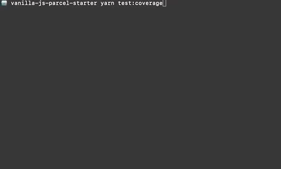
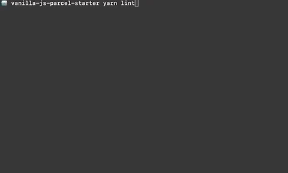

# 📦 vanilla-js-parcel-starter

A simple vanilla JavaScript starter project that uses Parcel.js and includes Jest, @testing-library/dom, ESLint and Prettier

## Scripts

- `start` - Starts a development server on port `1234`
- `build` - Builds production code
- `lint` - Runs ESLint linter
- `test` - Runs jest tests
- `test:coverage` - Runs jest tests and generates a coverage report
